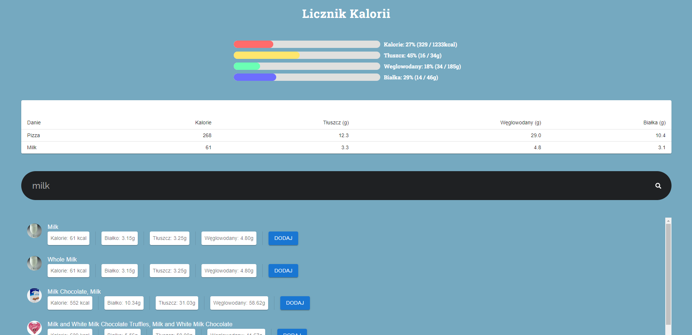

# KALORIE

Wykonana w ReactJS aplikacja do śledzenia dziennego zapotrzebowania energetycznego organizmu. Aplikacja pobiera od użytkownika wiek, wzrost i płeć i na jej podstawie określa zapotrzebowanie. Po wypełnieniu danych użytkownik może wyszukiwać dania w języku angielskim i dodać je jako spożyte.

## Aby uruchomić projekt należy wpisać poniższe komendy:
```
npm install
npm start
```

